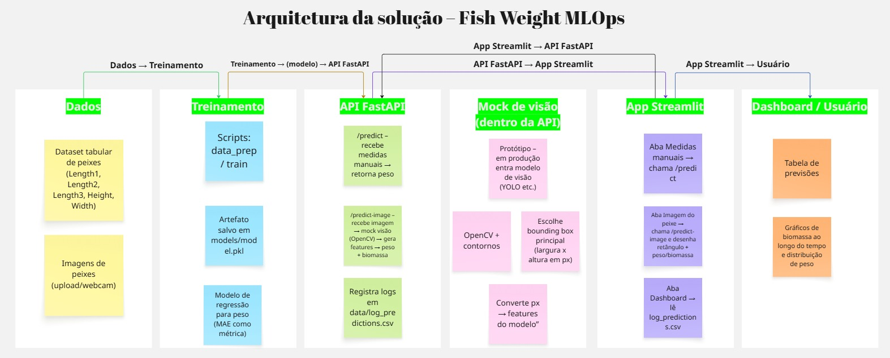
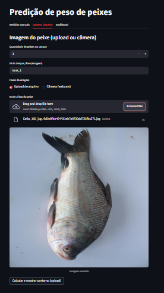
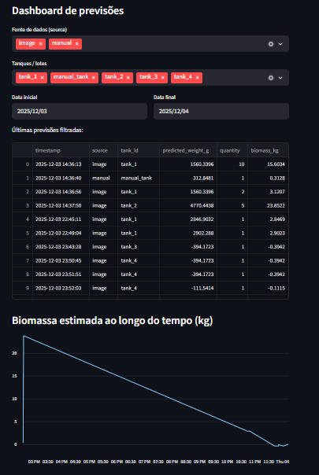

# 🐟 Predição de Peso e Biomassa de Peixes

## Problema

Estimar:

- peso individual de peixes (g) a partir de medidas morfométricas;
- biomassa total de um tanque (kg) = peso médio × quantidade.

O foco é demonstrar um pipeline de MLOps (treino → API → app → logs → dashboard), aproximando o cenário de uso real da empresa (câmera + biomassa em tempo quase real).

---

## Arquitetura da solução



- **Modelo de ML (tabular)**  
  - Regressão treinada em dataset de peixes com as features  
    `Length1`, `Length2`, `Length3`, `Height`, `Width`.  
  - Saída: peso previsto em gramas.

- **API (FastAPI)**  
  - `POST /predict`: recebe medidas manuais e retorna peso.  
  - `POST /predict-image`: recebe uma imagem, aplica um mock simples de visão (contornos via OpenCV) para extrair largura/altura em pixels, gera as 5 features, calcula peso e biomassa e registra logs em `data/log_predictions.csv`.

- **App Streamlit**  
  - Aba **Medidas manuais**: formulário para envio ao endpoint `/predict`.  
  - Aba **Imagem do peixe**: upload/webcam → chama `/predict-image` → exibe a foto com o retângulo detectado + texto de peso/biomassa sobre a imagem.  
  - Aba **Dashboard**: lê o CSV de logs, mostra tabela das últimas previsões e gráficos de biomassa ao longo do tempo e distribuição de peso.

---

## Screenshots

### App Streamlit – imagem do peixe



### Dashboard de biomassa



---

## Como executar o treinamento

O script de treino (ajuste o nome conforme seu repo, por exemplo `src/train_model.py`):

```bash
python src/train.py
```

O script realiza:

- **Leitura do dataset tabular**
- **Treinamento do modelo de regressão**
- **Logging automático no MLflow**
- **Salvamento do artefato em `models/`**

---

## ⚙️ Execução da Inferência

### 1️⃣ Subir a API FastAPI

```bash
uvicorn src.api.main:app --reload --host 0.0.0.0 --port 8000
```

A API ficará disponível em:

```
http://localhost:8000
```

### 2️⃣ Rodar o Streamlit

```bash
streamlit run app_streamlit.py
```

O app roda em:

```
http://localhost:8501
```

---

## 📊 Executando o MLflow UI

```bash
mlflow ui --backend-store-uri mlruns
```

Acesse:

```
http://localhost:5000
```

---

## 🐳 Execução via Docker

### 🔨 Build da imagem

```bash
docker build -t fish-weight-api .
```

### ▶️ Rodar o container

```bash
docker run -p 8000:8000 fish-weight-api
```

API disponível em:

```
http://localhost:8000
```

---

## 📬 Exemplos de chamadas via cURL

### 1️⃣ Predição manual

```bash
curl -X POST "http://localhost:8000/predict?tank_id=teste01"     -H "Content-Type: application/json"     -d '{
          "length1": 23.2,
          "length2": 25.4,
          "length3": 30.0,
          "height": 11.52,
          "width": 4.02
        }'
```

### 2️⃣ Predição via imagem

```bash
curl -X POST "http://localhost:8000/predict-image?quantity=10&tank_id=tank_3"      -F "file=@peixe.jpg"
```

---

## 📦 Principais Dependências

- Python 3.10+
- FastAPI, Uvicorn
- Pandas, NumPy, Scikit-learn
- OpenCV, Pillow
- Streamlit
- Requests
- MLflow

Instalação:

```bash
pip install -r requirements.txt
```

---

## 🚀 Possíveis Melhorias Futuras

- Uso de YOLO / Mask R-CNN para visão computacional real
- Calibração px → cm
- Modelos especializados por espécie
- Monitoramento de drift (EvidentlyAI)
- CI/CD com GitHub Actions
- Deploy serverless (Lambda) ou container orchestration (ECS/EKS)
